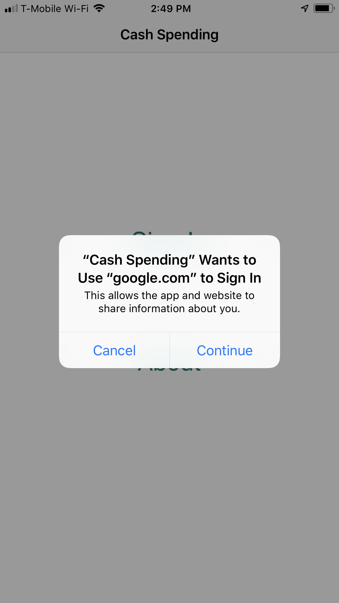
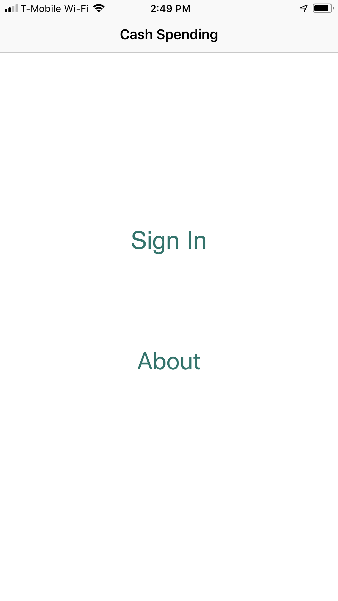
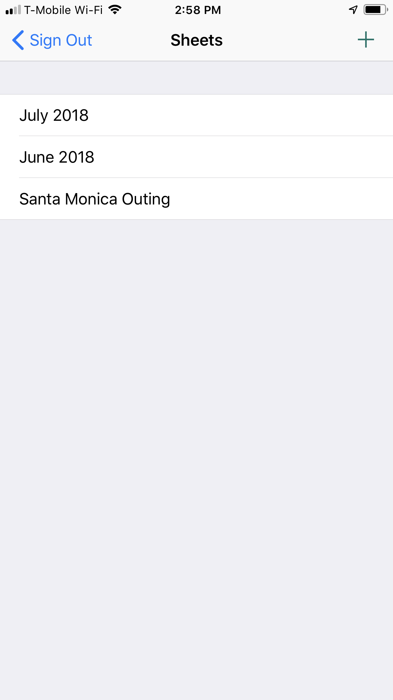
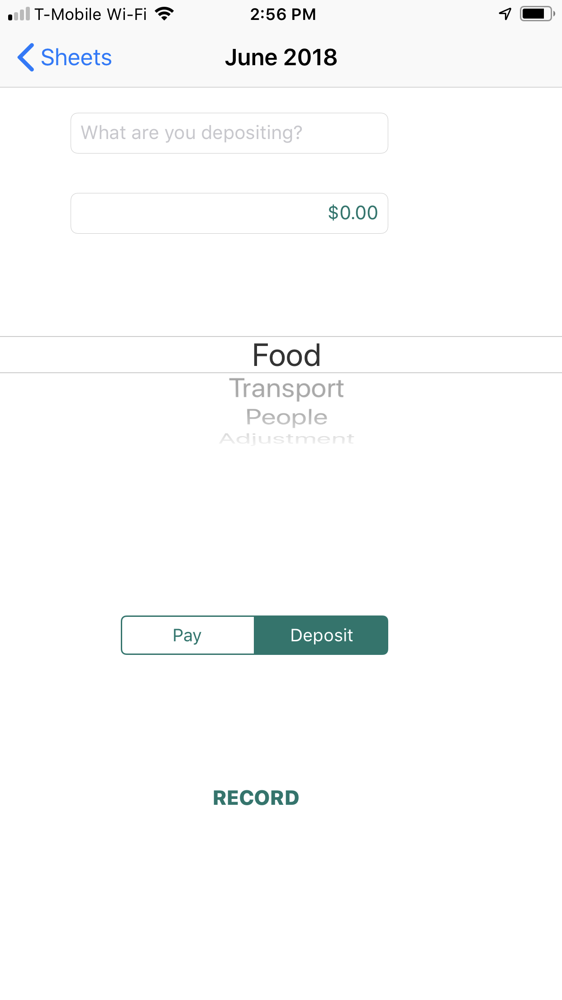
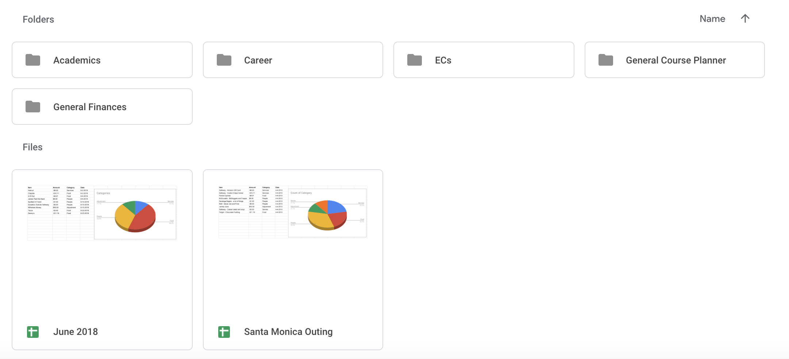
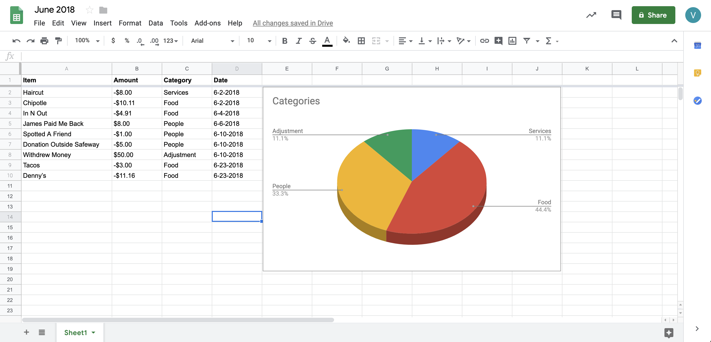

# CashSpending

<kbd></kbd> <kbd></kbd><kbd></kbd>
<kbd></kbd> <kbd></kbd>
 
<b> Spreadsheets are added straight to your Google Drive. </b>
<kbd></kbd>
 
<b> The app constructs a pie chart to help you budget your cash! </b>
<kbd></kbd>
